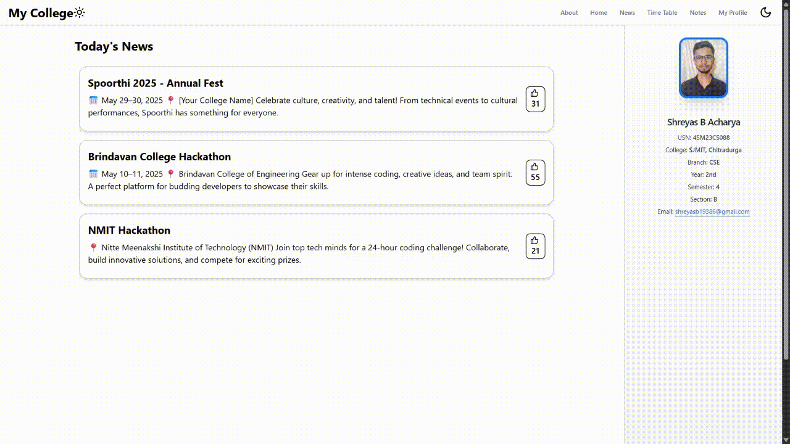
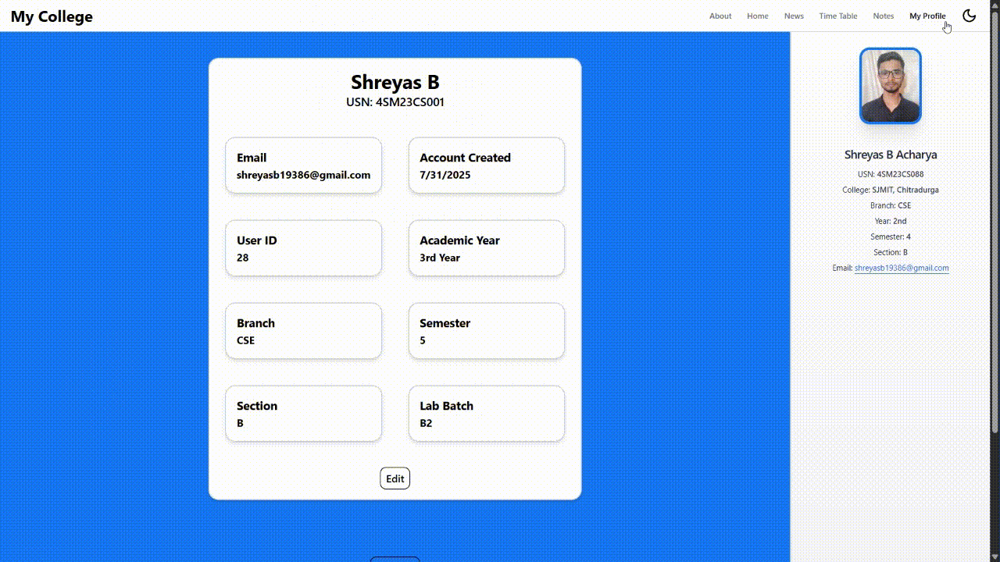
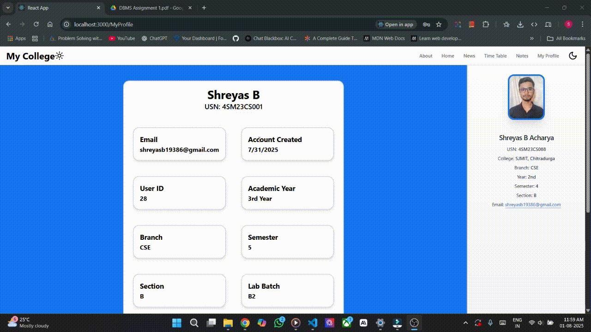
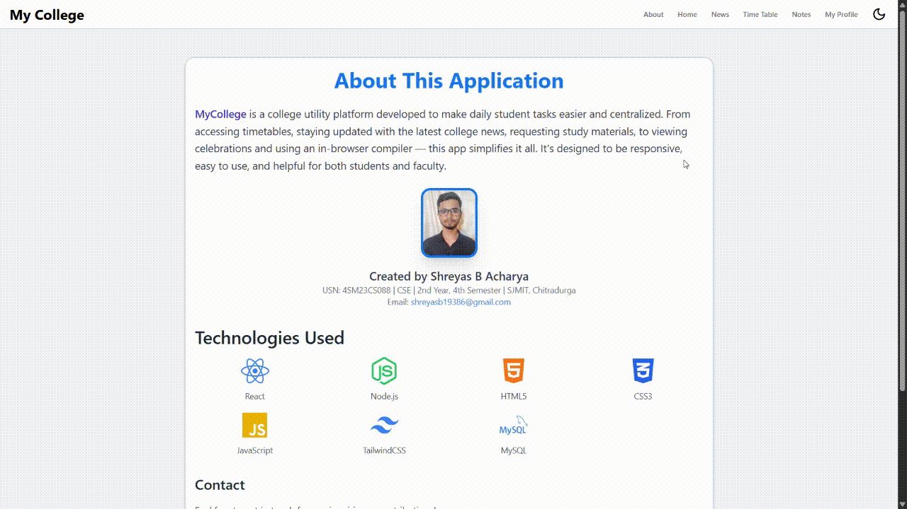

# MyCollege - College Utility Platform

A responsive college utility platform designed to centralize student resources and simplify daily academic tasks. This application provides personalized features for students to access timetables, college news, study materials, and more.

## © Copyright Notice
All rights reserved. This project is the intellectual property of Shreyas B Acharya.

**This repository is for demonstration/portfolio purposes only.  
Unauthorized copying, distribution, or claiming of this work as your own is strictly prohibited.**

This project is protected under copyright law. Any attempt to present this work as your own will result in legal action.

## 🌟 Features

- **Personalized Experience**: Students can register to get features tailored to their branch, section, semester, and year
- **News System**: 
  - Class Representatives (CRs) can create, update, and delete college news
  - Regular students can view and like news posts
- **Resource Library**: Download question papers and study notes
- **Timetable Management**:
  - View currently ongoing classes
  - See today's schedule
  - Access weekly timetable
- **User Profile**: Edit profile information and logout functionality
- **Fully Responsive**: Works seamlessly on both mobile and desktop devices

## 🛠️ Technologies Used

### Frontend
- [React](https://reactjs.org/) - UI Library
- [Tailwind CSS](https://tailwindcss.com/) - Styling
- [React Router](https://reactrouter.com/) - Navigation
- [Axios](https://axios-http.com/) - HTTP requests

### Backend
- [Node.js](https://nodejs.org/) - Runtime environment
- [Express](https://expressjs.com/) - Web framework
- [MySQL](https://www.mysql.com/) - Database
- [bcrypt](https://www.npmjs.com/package/bcrypt) - Password hashing
- [cors](https://www.npmjs.com/package/cors) - Cross-Origin Resource Sharing

## 🖥️ Screenshots

| `Desktop View` | `Mobile View` |
|---------|------------|
|||

### Mobile View

### Key Features
| Feature | GIFs |
|---------|------------|
| Home Page (All Users) |  |
| Home Page (Class Representative Admin) |  |
| Timetable Page |  |
| Notes Page |  |
| Profile Page |  |
| Registration/Sign-in |  |
| User Editing Profile |  |
| User Logout |  |
| Branch-based News |  |
| About Page|  |

## ⚙️ Installation

1. Clone the repository:
```bash
git clone https://github.com/your-username/MyCollege.git
cd MyCollege
```

2. Install backend dependencies:
```bash
cd BackEnd
npm install
```

3. Install frontend dependencies:
```bash
cd ../Frontend
npm install
```

4. Set up your MySQL database (create a schema and update database configuration in backend files)

5. Start the backend server:
```bash
cd ../BackEnd
npm run dev
```

6. Start the frontend development server:
```bash
cd ../Frontend
npm start
```


## 🚀 Future Plans (Version 2)

I'm currently developing a more robust version of this application with additional features:

- Built with React Native and Firebase for cross-platform support.

- **Advanced Features**:
  - ✅ Real-time Chat & Group Discussions
  - ✅ Connect Between Students
  - ✅ Timetable Integration
  - ✅ Credit Points System for Content Sharing
  - ✅ AI Chatbot for Study Assistance
  - ✅ Pomodoro Study Timer & Instagram Blocker
  - ✅ Assignment Due Date Reminders
  - ✅ In-app Compiler for Code Execution
  - ✅ Academic Calendar Integration
  - ✅ Nearby Students Discovery
  - ✅ Birthday Wish System
  - ✅ Career Path Guidance
  - ✅ Question Paper Prediction using AI/ML
  - ✅ Profile Avatars & Backgrounds
  - ✅ GPS Photo Uploads

- **Deployment**: Planning to publish on Google Play Store once development is complete


## 📬 Contact

**Shreyas B Acharya**  
📧 [shreyasb19386@gmail.com](mailto:shreyasb19386@gmail.com)

---

*This project is currently in development. Version 1 is a demo application, while Version 2 is being built as a full-featured production-ready application.*
```bash
cd ../Frontend
npm start
```
